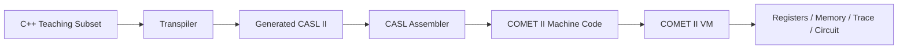

# Architecture Overview

- Audience: Developers and maintainers
- Status: Canonical
- Last reviewed version: 0.1.0
- Classification: Canonical
- Related: [Repository Structure](repository-structure.md), [WASM Bridge](wasm-bridge.md)

stugx.CASL separates source ownership, compilation, machine execution, and presentation. Web and Tauri package the same React frontend and WASM core.

Direct CASL input enters at the assembler. The TypeScript CoreAdapter boundary provides Mock development/test and WASM implementations, but production builds require WASM and fail when its assets are missing.

The application store owns one document and derived compiler/runtime views. File operations, persistence adapters, diagnostics, and lesson progress use explicit controllers or registries rather than component-level browser access.

Historical implementation evidence remains under `docs/phase*.md`. Current contracts are summarized by this guide, the [Technical Reference](../README.md), and the ADRs.
