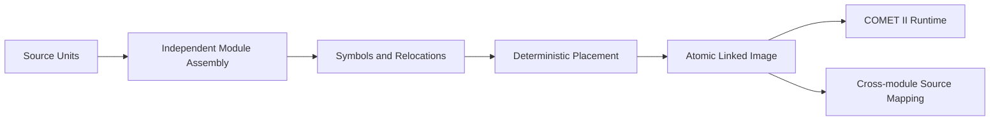

# CASL Linker

- Audience: Developers and maintainers
- Status: Canonical
- Last reviewed version: 0.1.0
- Classification: Canonical
- Related: [Linker Profile](../casl-multi-program-linker-profile.md), [Relocation Model](../link-relocation-model.md), [Module Ownership](../module-source-ownership.md)

The C++ Core is the production authority. `Assembler::assembleModule` emits relative words, symbols, relocations, and module-owned mappings. `Linker` validates the project snapshot and produces a candidate `LinkedProgramResult`. The WASM bridge exposes bounded JSON DTOs; Mock implements the same contract for deterministic frontend tests.

The main module starts at `#0020`, followed by modules in explicit order. Relocation changes only declared address words. The final words, ownership table, symbols, relocations, instructions, and source maps are immutable after commit.

Do not add source concatenation, global parser symbol state, UI-side inverse computation, a second VM, project persistence, or pathname-derived identity. Changes must retain single-module word-for-word parity and Mock/C++/WASM/Tauri behavior.
